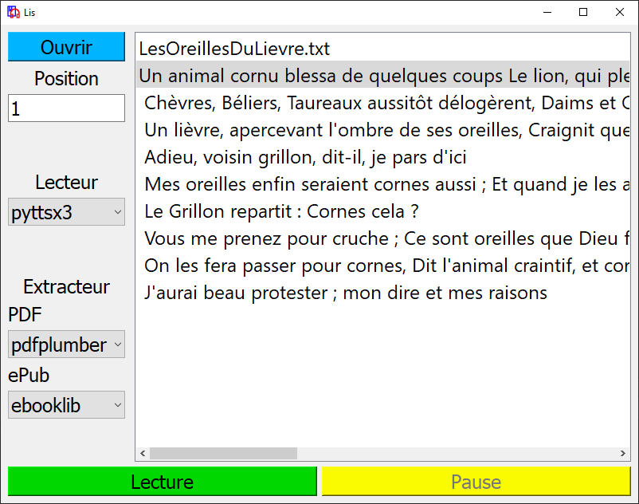

# Lis
Lis (moi ça !) : application de lecture (texte à la parole) de fichiers textes.

### Pourquoi "Lis" :
* objectif simple : lecture de fichiers textes
* spécialisé : lecture de textes en français
* diversifié : plusieurs méthodes de TTS disponibles
* accessible : facile à installer et à utiliser
* pour tous : gratuit et open source

### Comment s'en servir ?

* Ouvrez ou glissez un fichier txt, pdf ou epub
* Selectionner le lecteur
* Appuyez sur "Lecture"

